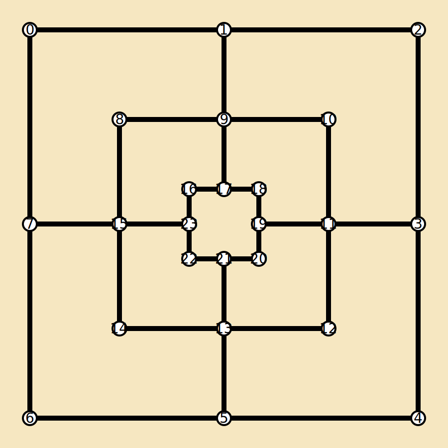

# 🎮 Nine Men’s Morris in C

Implementation of the classic board game **Nine Men’s Morris** in pure **C**, with a focus on **bitwise operations**, **low-level logic**, and **game development fundamentals**.  
This project demonstrates skills in **efficient memory usage**, **data representation**, and **algorithmic thinking**.

---

## 📖 About the Game

Nine Men’s Morris is a strategy board game for two players dating back to the Roman Empire.  
The goal is to form "mills" (three pieces in a row), which allows you to remove an opponent’s piece.  
A player wins when the opponent has fewer than 3 pieces left.  

🔗 Learn more about the rules here: [Nine Men's Morris (Wikipedia)](https://en.wikipedia.org/wiki/Nine_men%27s_morris)

---

## ✨ Highlights

- 🧩 **Bit-level board representation** → each of the 24 board positions is stored in a single bit.  
- ⚡ **Optimized operations** → placing, moving, and removing pieces using bitwise manipulation.  
- 🎲 **Complete game logic** → from placing pieces to detecting mills and removing opponent pieces.  
- 🛠️ **Clean modular structure** → separated into header, logic, and main gameplay loop.  

---

## 🧑‍💻 Technical Skills Showcased

- **C Programming** (structs, pointers, modular design).  
- **Bit Manipulation** (`setbit`, `getbit`, `getbits`, etc).  
- **Game Logic** (valid moves, mills detection, win conditions).  
- **Algorithm Design** (efficient difference checking between game states).  

---

## 🧠 Why Use a 24-bit Board?

The Nine Men’s Morris board has **exactly 24 valid positions**.  
By representing the board as a **single integer**, each bit corresponds to one position:


- `1` = position occupied.  
- `0` = position empty.  

This approach allows:
- Very fast checks (`getbit`) to see if a position is occupied.  
- Simple piece placement (`setbit`).  
- Efficient comparison between two game states (using bitwise operators).  

Instead of storing arrays or complex data structures, the **board is just one integer** — compact, elegant, and efficient.

---

## 🗺️ Bit Mapping to the Board

Here’s how the **24 bits** map to the traditional Nine Men’s Morris board:  



Each number corresponds to a bit index (**0–23**) in the board integer.  
This mapping makes it possible to check for mills and valid moves using **bit masks**.

---

## 🕹️ How to Play

1. Compile the project:
   ```bash
   gcc morris.c ninemens.c -o ninemens

   ninemens/
├─ main.c         # Main game loop
├─ ninemens.c     # Core game logic and bit manipulation
├─ ninemens.h     # Function prototypes and constants
├─ README.md      # Documentation

